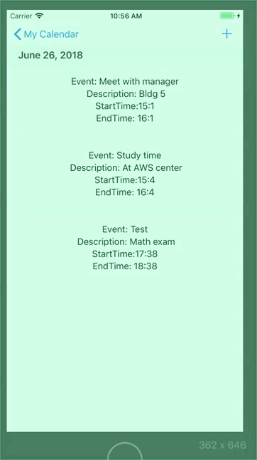
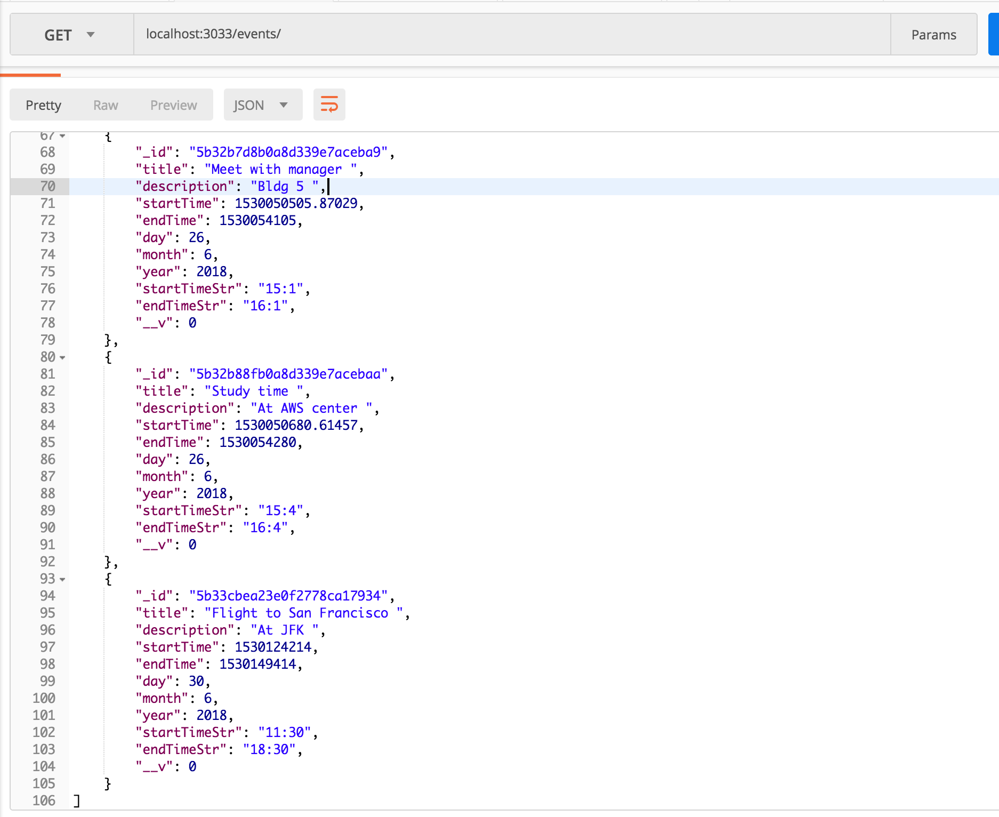

# TTP Spotify Calendar Challenge 

## Technology Used
#### Front end 
 * Xcode 9.4.1
 * Swift 4 

#### Back End 
  * Visual Studio Code
  * Node js
  * Mongo DB  

## Run

Backend runs locally make sure to have the following dependencies installed

  * body-parser 1.18.3
  * express 4.16.3
  * mongodb  3.0.10
  * mongoose 5.1.6
  * morgan 1.9.0
  * nodemon 1.17.5

Once those dependencies are installed run command  in terminal in backend folder directory 

``` Swift 
 nodemon server.js
```

for the front end open in xcode: 

``` Swift 
 Spotify_Calendar/Spotify_Calendar.xcodeproj
```


## Features

* Switch between months and years
* Calendar shows accurate dates 
* GET request 
* POST request
* Delete request

## Demo

Events for the day | Posting an event to calendar
--- | ---
 | 

Delete Event  
--- 


postman get request
--- 

 

##Thank you 

It was a pleasure to build this app. It was the first time I dabbled in Node.js and MongoDB so this was a fun challenge! I hope you enjoy Thank you! 

